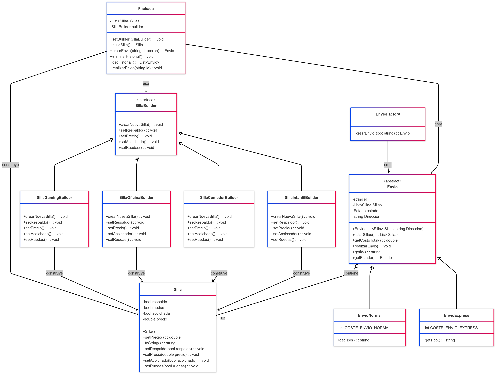

# Silla Store

Aplicación Flutter que implementa un sistema de gestión de sillas y envíos usando patrones de diseño.

## Funcionalidades

- Catálogo de 4 tipos de sillas (Gaming, Oficina, Comedor, Infantil)
- Carrito de compras con cálculo automático de totales
- Sistema de envíos Normal y Express
- Seguimiento de estados de envío
- Persistencia con API REST

## Patrones Implementados

- **Builder**: Construcción de sillas según tipo
- **Factory**: Creación de envíos Normal/Express
- **Facade**: Simplificación de operaciones

# Requisitos del Software

## Requisitos CRUD

### RF01 - Crear Silla
Construir sillas dinámicamente usando patrón Builder según tipo seleccionado (Gaming, Oficina, Comedor, Infantil).

### RF02 - Consultar Sillas
Visualizar catálogo de sillas disponibles con precios, descripciones e iconos distintivos.

### RF03 - Actualizar Carrito
- Agregar sillas al carrito desde catálogo
- Modificar cantidad eliminando sillas individuales
- Actualizar total automáticamente

### RF04 - Eliminar del Carrito
Remover sillas individuales o limpiar carrito completo.

### RF05 - Crear Envío
Crear nuevos envíos (Normal/Express) con cálculo automático de costos y asignación de ID único.

### RF06 - Consultar Envíos
Visualizar lista completa de envíos con estado, detalles, tipo, dirección y costo total.

### RF07 - Consultar Historial
Obtener específicamente envíos con estado "Entregado" para historial.

### RF08 - Actualizar Estado de Envío
Cambiar estado del envío: Pendiente → En Tránsito → Entregado con persistencia en servidor.

### RF09 - Eliminar Envío Individual
Eliminar envíos específicos por ID del servidor y lista local.

### RF10 - Eliminar Historial Completo
Eliminar permanentemente todos los envíos con estado "Entregado" del historial.

## Otros Requisitos Funcionales

### RF05 - Gestión de Catálogo de Sillas
Mostrar catálogo con 4 tipos de sillas (Gaming, Oficina, Comedor, Infantil) con precios y descripciones.

### RF06 - Gestión de Carrito de Compras
- Agregar sillas al carrito desde el catálogo
- Visualizar productos en carrito con precio total
- Eliminar sillas individuales del carrito
- Limpiar carrito completo
- Mostrar contador de productos en el ícono del carrito

### RF07 - Construcción Dinámica de Sillas
Utilizar patrón Builder para crear sillas con características específicas según tipo (respaldo, ruedas, acolchado, precio).

### RF08 - Gestión de Tipos de Envío
- **Envío Normal**: Costo adicional $10, entrega en 20 segundos
- **Envío Express**: Costo adicional $25, entrega en 10 segundos

### RF09 - Interfaz de Usuario Multi-Pestaña
Navegación entre tres secciones principales:
- Catálogo de sillas
- Carrito de compras
- Historial de envíos

### RF10 - Validación y Notificaciones
- Validar carrito no vacío antes de crear envío
- Validar dirección de envío obligatoria
- Mostrar notificaciones de éxito/error para todas las operaciones

# Diagrama UML

# Autores:

- Karim Said Lupiañez
- Pablo Tamayo López
- Blanca Girón Ricoy